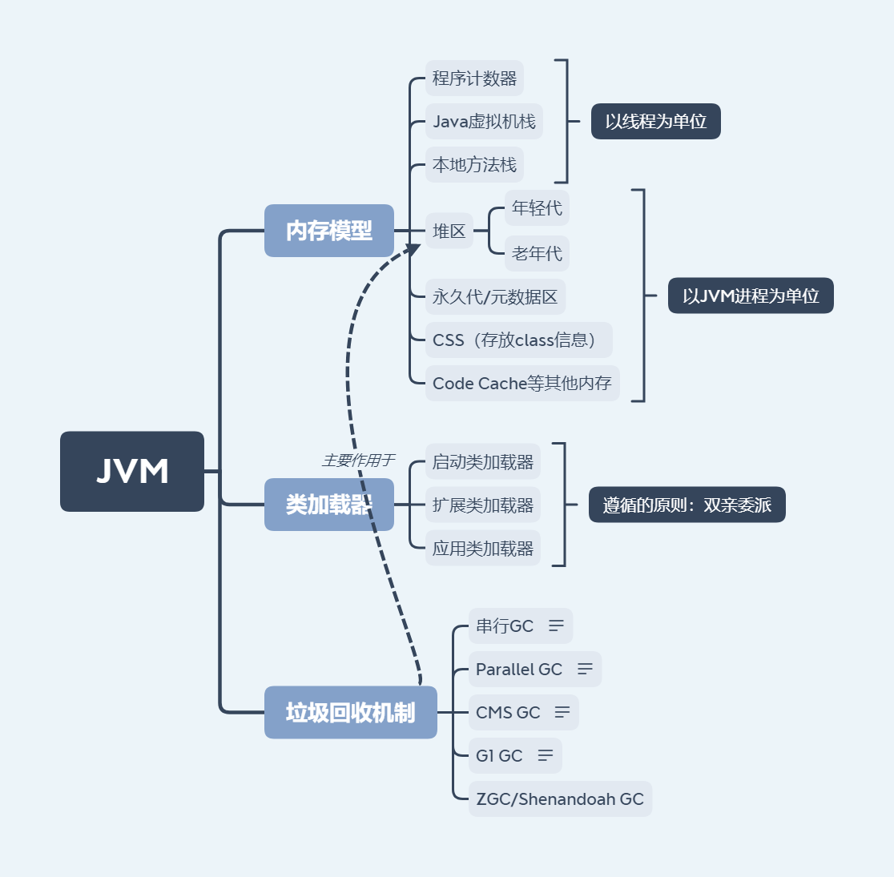

# 一  JVM

 JVM中的Java解释器负责将编译好的字节码文件解释成特定的机器码实现了程序的运行。正是由于JVM的存在实现了程序的跨平台性。JVM主要包括三大块的知识：与JVM内存模型相关的知识，与类加载相关的知识以及JVM内部的垃圾回收器。JVM是JAVA的基石，需要JAVA程序员对它有充分的了解，因为系统的性能调优是离不开它的，可能很多系统的性能问题都出在JVM上。

# 二  NIO

NIO，全称New IO，相较于BIO可以实现实现非阻塞式的高伸缩性网络。Java自身的NIO设计更偏底层，其复杂性、扩展性等方面，存在一定的局限，Netty在基础的NIO等类库的基础上进行了很多改进，构建了更加易用、高性能的网络框架。目前Netty主要被应用到各种API网关的实现中，如Zuul2、Spring Cloud Gateway等网关中。

# 三  并发编程

并发编程领域可以抽象成三个核心问题，分工、同步和互斥。所谓分工类似于现实中一个组织完成一个项目，项目经理要拆分任务，安排合适的成员去完成。Java SDK 并发包里的 Executor、Fork/Join、Future 本质上都是一种分工方法。

同步，主要指的就是线程间的协作。在Java并发包中CountDownLatch、CyclicBarrier、Semaphore、wait/notify等可以用来解决特定场景下的线程协作问题。

分工、同步主要强调的是性能，而并发程序里还有一部分是关于正确性的，即“线程安全”。在并发程序里导致不确定的主要源头是可见性问题、有序性问题和原子性问题，为了解决这三个问题，Java语言引入了内存模型，内存模型提供了一系列的规则，利用这些规则，我们可以避免可见性问题、有序性问题，但是还不足以完全解决线程安全问题。解决线程安全问题的核心方案还是互斥。所谓互斥，指的是同一时刻，只允许一个线程访问共享变量。在Java语言里synchronized、SDK里的各种Lock、基于无锁数据结构的原子类等都可用来解决互斥问题。

# 四  Spring和ORM等框架

Spring是一个轻量级的控制反转(IoC)和面向切面(AOP)的容器框架。为简化软件开发的复杂性而创建的，Spring使用的是基本的JavaBean来完成以前只可能由EJB完成的事情。Spring主要包含6大模块:Spring core, Testing, DataAccess, Spring MVC、Integration和Languages,从而可以完成服务端的开发工作，以及对各种数据库、消息队列、缓存中间件的访问。但是随着Spring的不断发展，功能和使用变得复杂，为了进一步简化开发，Spring Boot应运而生，Spring Boot是Spring的一套快速配置的脚手架，关注于自动配置和配置驱动，它使得创建独立运行、生产级别的Spring应用变得简单。

# 五  关系型数据库MySQL以及分库分表

关系型数据库,如MySql数据库，在企业级应用中充当数据持久化存储的作用。在构建数据库表结构时要遵循建表的原则，避免出现数据冗余等问题，建立合适的索引，提高检索效率。在编写SQL语句时要善于分析SQL语句的执行效率，编写出具有较高的执行效率的SQL语句。随着用户访问量、数据量的增加以及对服务高可用的要求，促使单机数据库向数据库集群演变，由此演变出了读写分离、主从切换、分库分表以及分布式事务等相关技术。这些技术共同完成了企业级应用后台数据层的构建工作。

# 六  分布式缓存

为解决系统各级处理速度不匹配的问题，我们将使用频率高且读的频率远远大于写的频率的数据放入缓存，以缓存的方式进行访问。缓存可分为本地缓存、远程缓存以及内存网格，其中远程缓存中的Redis缓存使用最为广泛，常处于服务处理程序和关系型数据库的中间位置，以期提高数据的检索效率。

# 七  分布式消息队列

消息队列能够有效的实现异步的消息通信，简化参与各方复杂的依赖关系，是实现系统间通讯的较优的解决方案。在请求量很大的时候，消息队列可以起到缓冲的作用，减轻应用的压力，故也常被用高并发的场景中。开源的消息队列可以被分为三大类，以ActiveMQ、RabbitMQ为代表的第一代MQ，以Kafka、RocketMQ为代表的第二代MQ和以Pulsar为代表的第三代MQ。对于消息队列的选择，需要我们根据具体的应用场景以及各种MQ的特点最终选择出合适的消息队列。

